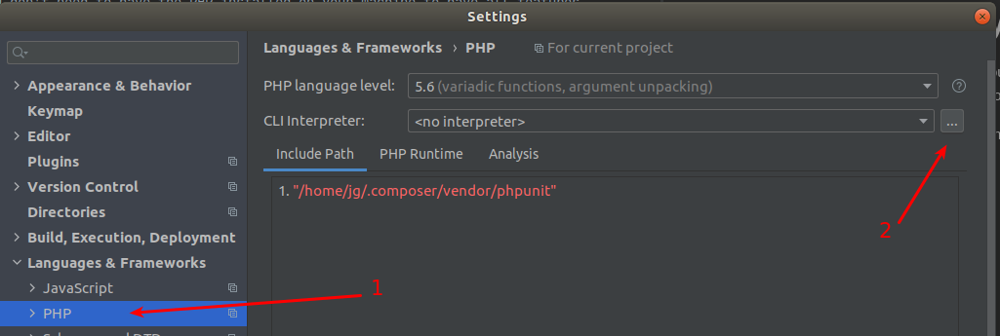
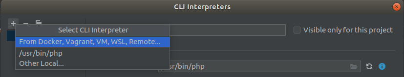
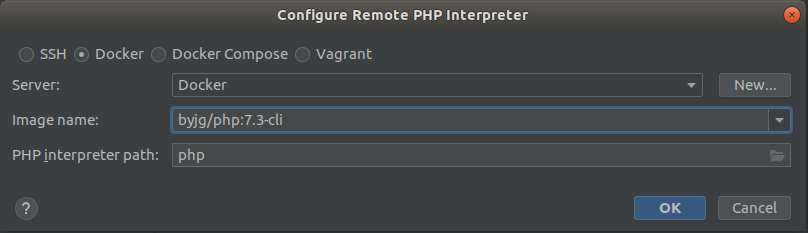
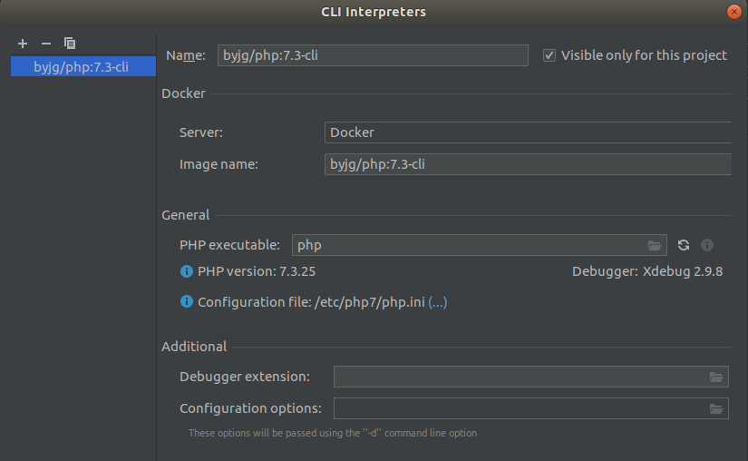
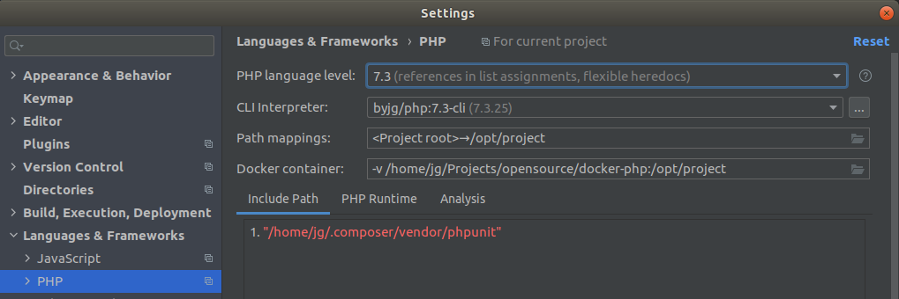

# Using the Image in your IDE

You don't need to have the PHP installed on your machine to have all features
your IDE can offer. You can use the Docker PHP Image ByJG. 

If you are using the IDE [PHPStorm from](https://www.jetbrains.com/phpstorm/) Jetbrains you can easily add any PHP version using the
tutorial below.

First, go to "File -> Settings -> Languages/Framework" and click in the elispis 
besides the "CLI Interpreter" text box. 

Then, click in "Add (+) -> From Docker, Vargrant, etc"

The next screen you have to set the proper image. If we want to use the PHP Version 7.3
we need to fill the image `byjg/php:7.3-cli`. Make sure you have docker installed and properly
setup in the [PHPStorm IDE](https://www.jetbrains.com/phpstorm/). If you can't see the "Server" `docker`, click in "New" and 
after setup continue the process as you can see below:

If everything is OK you can see the PHP Version and XDebug. You can deselect the option
"Visible only for this project" if you want to have this configurations for all PHP projects you have.

And voilá. Just select this new version to your project and you can have auto-complete, debug, and etc 
as if you have the PHP installed in your machine

You can repeat this process for any PHP version you want. 